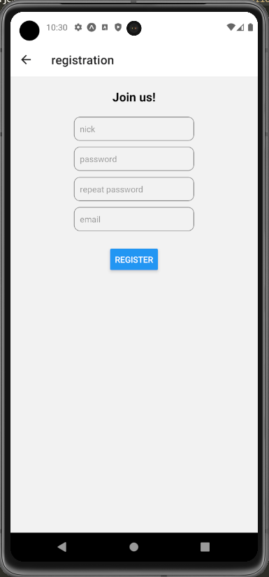
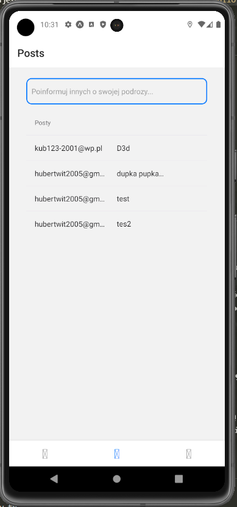
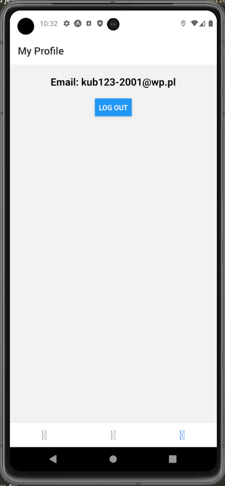

<!-- # Project-Hitchhiker
## Jak Włączyć debuger na swoim telefonie?
1. Na wpisz w terminalu: ``npm install``
1. ściągnij pakiet nawigatorowy:``npm install @react-navigation/native @react-navigation/stack``
1. ściągnij pakiet image-picker: ``npx expo install expo-image-picker``
1. Na wpisz w terminalu: ``npx expo start``
1. Pobierz apke ``expo go`` na telefon
1. Zeskanuj kod QR
1. Aby wprowadzić zmiany klikasz trójkąt by odpalic program -->

<!-- ## Jak Włączyć debuger na swojej przegladarce? -->
# Project-Hitchhiker
## Spis treści
* [Opis ogólny](#opis-ogólny)
* [Technologie](#technologie)
* [Zrzuty ekranu](#zrzuty-ekranu)
* [Szczegółowy opis obsługi projektu](#szczegółowy-opis-obsługi-projektu)
* [Najważniejsze funkcje programu](#najważniejsze-funkcje-programu)
* [Twórcy](#twórcy)
## Opis ogólny
* Project-Htichhiker jest aplikacja, która została stworzona w celu nie tylko ułatwieniu życia ludziom, a także działaniu na rzecz planety. Ludzie mogą za jej pomocą podróżować razem z ludźmi jadącymi w te same miejsca, bądź ich okolice.
* Za pomocą rozwiązań jakie przedstawia nasza aplikacja, chcemy zmniejszyć korki na drogach, za czym idzie mniejsza ilość aut na drogach, która przyczyni się do zmniejszenia śladu węglowego na Ziemii.
* Chcemy ułątwić ludziom dojazd na ważne spotkania, do pracy, na spotkanie ze znajomymi czy powroty do domów w godzinach szczytu. Wierzymy ,także że w pewnym stopniu przyczynimy się do zachamowania postępujących zmian klimatycznych oraz rozwijajacych się ludzkich chorób.
## Zrzuty ekranu

### Główna strona po włączeniu aplikacji

### Formularz rejestracyjny konta

### Mapa umożliwiająca zaznaczenie trasy podróży

### Formularz apelujący o rozpoczęciu podróży, bądź chęci dołączenia się

### Profil użytkownika

## Technologie
* ``Expo app`` - framework i platforma do tworzenia aplikacji mobilnych na iOS i Androida za pomocą JavaScript i React. Umożliwia szybki rozwój dzięki bogatemu zestawowi API i narzędzi, takich jak hot reloading i Expo Client do testowania na urządzeniach. Pozwala na publikowanie aplikacji oraz aktualizacje Over-the-Air (OTA), co upraszcza zarządzanie wersjami.

* ``React js`` - popularna biblioteka JavaScript stworzona przez Facebooka do budowy interfejsów użytkownika, głównie w aplikacjach jednostronowych (SPA). Umożliwia tworzenie komponentów, które mogą być ponownie wykorzystywane, co upraszcza zarządzanie złożonymi interfejsami. React.js wykorzystuje wirtualny DOM, co zwiększa wydajność aplikacji przez minimalizację bezpośrednich aktualizacji DOM.

* ``Node js`` - środowisko wykonawcze JavaScript, które umożliwia uruchamianie kodu JavaScript po stronie serwera. Zbudowane na silniku V8 Google Chrome, Node.js jest znane z wysokiej wydajności i skalowalności, dzięki nieblokującej obsłudze I/O. Jest szeroko używane do tworzenia serwerów internetowych, aplikacji sieciowych i narzędzi do budowania aplikacji.

# Szczegółowy opis obsługi projektu
## Dodanie emulatora
 Możliwe jest uruchomienie aplikacji na emulatorze telefonu na komputerze, w aplikacji na swoim fizycznym telefonie i w przeglądarce.
### Pobieranie emulatora android na komputer (Dla Windows/Linux/MacOS)
1. Wejdź na stronę ``https://developer.android.com/studio``.
1. Pobierz aplikacje ``Android Studio`` dla odpowiedniego systemu.
1. W przebiegu instalacyjnym wystarczy zawsze klikać ``NEXT``
1. Po uruchomieniu aplikacji należy wejść w katalog ``Projects`` wejść w zakłądkę ``Virtual Device Manager`` (może być też ukryta pod 3 kropkami w prawym górnym rogu aplikacji)
1. Jeżeli posiadasz już stworzony emulator przejdź do punktu ``10.``
1. Jeżeli nie masz stworzonego emulatora możesz stworzyć go klikając guzik ``+``
1. Wybierz odpowiadający Ci typ telefonu, a następnie kliknij ``next``
1. Wybierz interesujący Cię system. Powinieneś mieć domyślnie zainstalowany system ``UpsideDownCake``, znajdziesz go w zakładce ``x86 Image``. Przejdź dalej naciskając przycisk ``Next``
1.  Nazwij swój emulator i kliknij ``Finish``
1. Jeżeli znajdujesz się w Device Manage znadź swój emulator i kliknij przycisk trójkąta
1. Jeżeli twój telefon nie jest włączony kliknij ikone włączania znajdująca się po prawej stronie emulatora

## Możliwość uruchomienia na dowolnym fizycznym telefonie
1. Na urządzeniu należy pobrać aplikacje ``Expo``. Dzięki niej będzie uruchamiany projekt.

## Pobieranie koniecznych bibliotek i rozszerzeń
 Aplikacja napisana w node.js pozwala automatycznie zainstalować potrzebne biblioteki do debugowania aplikacji. 
 Program sprawdzi czy biblioteki są zainstalowane, a jeśli nie to je pobierze.
 Biblioteki są posortowane na npm i npx, więc ten sposób segregacji należy zachować.
 Włączenie programu jest banalnie proste. Wystarczy wejść w plik ``pobierz biblioteki.js`` i kliknąć ``strzałkę`` bądź wpisać komendę ``node <link do pliku>``.

## Włączanie debugowania aplikacji
### Dla emulatora android studio
1. Rozpocznij debugging aplikacji wpisując znajdując się w folderze ``Project-Hitchiker`` w terminalu ``npm run android``
1. Możesz również napisać ``npm start``, a po pełnym uruchomieniu ``a`` co oznacza ``android``.

### Dla dowolnego fizycznego telefonu
1. Rozpocznij debugging aplikacji wpisując znajdując się w folderze ``Project-Hitchiker`` w terminalu ``npm start``.
1. Po pełnym uruchomieniu wyświetli się kod ``QR``, który należy zeskanować urządzeniem. Uruchomi to debuger applikacji w aplikacji ``Expo``

<!-- ### Walidacja bazy danych
1. Jeżeli dane takie jak hasło, nazwa użytkownika w bazie danych będą się zgadzać z danymi naszego konta testowego, walidator funkcji GET zwróci nam wartość TRUE, a więc pobieranie danych dział poprawnie
1. Nastepnie za pomocą działającego pobierania danych będziemy wstanie sprawdzić czy tworząc nowe konto użytkownika wartości poprawnie dodadzą się do bazy danych, za pomocą walidatora funkcji GET, który powinien zwrócić wartość TRUE
1. Później znowu za pomocą już działającego pobierania danych będziemy w stanie sprawdzić czy usuwanie użytkownika działa poprawnie, za pomocą walidatora funkcji GET, który powinien zwrócić wartość FALSE, czyli dane zostały usunięte -->

## Najważniejsze funkcje programu:
###  ``UserAddPost``
1. Opis funkcji -
W pliku firebase.js znajduje się funkcja ``UserAddPost(id,nick,tresc)``, która dodaje nowy post zawierający konkretną treść dla osoby o danym nicku. 
1. Test wydajnościowy funkcji -
Funkcja będąc użytą za każdym razem sprawdza ile czasu zajeło jej dodanie postu. Wynik podawany jest w sekundach.
1. Test jednostkowy funkcji -
Testem jednostkowym tej funkcji zajmuje się funkcja ``TestPolaczeniaBazyDanych()``. Dodaje ona za pomocą testowaniej funkcji post o id ``0`` (0 jest id testowym. Posty dodawane z aplikacji mają id zaczynające się od 1), nicku ``test``, i treści ``test``. Nastepnie sprawdzana jest funkcją ``GetPost``, która sprawdza czy post o id 0 pojawił się w bazie danych czy nie ma go. Jeśli postu nie ma znaczy że funkcja nie działa poprawnie, a jeśli jest znaczy, że działa  prawidłowo.
###  ``GetPost``
1. Opis funkcji -
W pliku firebase.js znajduje się funkcja ``GetPost(id)``, która pobiera dane postu o konkretnym ``id``. Funkcja zwraca wartość ``false`` jeśli nie będzie mogła znaleźć postu w bazie danych i zwraca wartości postu jeśli jej się to uda. 
1. Test wydajnościowy funkcji -
Funkcja będąc użytą za każdym razem sprawdza ile czasu zajeło jej pobranie postu. Wynik podawany jest w sekundach.
1. Test jednostkowy funkcji -
Testem jednostkowym tej funkcji zajmuje się funkcja ``TestPolaczeniaBazyDanych()``. Dodaje lub aktualizuje ona post o id ``0`` za pomocą funkcji ``UserAddPost``. Nastepnie pobiera wartości postu z bazy danych za pomocą testowanej funkcji, post zostaje usunięty funkcją ``UsunPost``, a funkcja próbuje pobrać z niego wartości jesze raz. Jeśli funkcja nie znajdzie postu po jego dodaniu albo znajdzie post po tym jak został usunięty oznacza to że nie działa ona prawidłowo.
###  ``UsunPost``
1. Opis funkcji - 
W pliku firebase.js znajduje się funkcja ``UsunPost(id)``, która usuwa post o konkretnym ``id``.  
1. Test wydajnościowy funkcji -
Funkcja będąc użytą za każdym razem sprawdza ile czasu zajeło jej usunięcie postu. Wynik podawany jest w sekundach.
1. Test jednostkowy funkcji -
Dodaje lub aktualizuje ona post o id ``0`` za pomocą funkcji ``UserAddPost``. Nastepnie sprawdza czy post istnieje funkcją ``GetPost``, post zostaje usunięty za pomocą testowanej funkcji, a funkcja ``GetPost``próbuje pobrać z niego wartości jesze raz. Jeśli funkcja ``GetPost`` znajdzie post po tym jak funkcja etstowana poróbowała go usunąć oznacza to że funkcja nie działa poprawnie.
###  ``checkAndInstallNpxLibraries``
1. Opis funkcji -
Funkcja znajduje się w pliku ``pobierz_biblioteki.js`` i sprawdza czy wszystkie biblioteki z pliku ``npx_commands.txt`` zostały zainstalowane, a jeśli nie to instaluje je.
1. Test wydajnościowy funkcji -
Funkcja sprawdza ile czasu zajęło jej sprawdzenie i zainstalowanie każdej z bibliotek i zwraca go jako ``time``. Wynik podawany jest w sekundach.
1. Test jednostkowy funkcji - 
Funkcja samodzielnie sprawdza czy udało jej się zainstalować daną bibliotekę. Te nieudane pobrania wprowadza do listy ``failed``, a udane do listy ``success`` i obie zwraca.
###  ``checkAndInstallNpmLibraries``
1. Opis funkcji - 
Funkcja znajduje się w pliku ``pobierz_biblioteki.js`` i sprawdza czy wszystkie biblioteki z pliku ``npm_commands.txt`` zostały zainstalowane, a jeśli nie to instaluje je.
1. Test wydajnościowy funkcji -
Funkcja sprawdza ile czasu zajęło jej sprawdzenie i zainstalowanie każdej z bibliotek i zwraca go jako ``time``. Wynik podawany jest w sekundach.
1. Test jednostkowy funkcji -
Funkcja samodzielnie sprawdza czy udało jej się zainstalować daną bibliotekę. Te nieudane pobrania wprowadza do listy ``failed``, a udane do listy ``success`` i obie zwraca.

### ``createTestUser``
1. Funkcja ``createTestUser`` służy do tworzenia testowego użytkownika w systemie. Po wywołaniu tej funkcji, nowy użytkownik zostanie utworzony przy użyciu podanego adresu e-mail i hasła. Następnie funkcja sprawdza czas wykonania operacji tworzenia użytkownika i loguje czas wykonania w konsoli. Po utworzeniu użytkownika, funkcja wywołuje ``signInTestUser``, aby zalogować nowo utworzonego użytkownika.

### ``signInTestUser``
1. Funkcja ``signInTestUser`` służy do logowania testowego użytkownika do systemu. Po wywołaniu tej funkcji, użytkownik zostanie zalogowany przy użyciu podanego adresu e-mail i hasła. Funkcja sprawdza czas wykonania operacji logowania i loguje ten czas w konsoli. Po zalogowaniu, funkcja wywołuje ``getCurrentUserInfo``, aby pobrać informacje o zalogowanym użytkowniku.

### ``getCurrentUserInfo``
1. Funkcja ``getCurrentUserInfo`` służy do pobierania informacji o aktualnie zalogowanym użytkowniku. Po wywołaniu tej funkcji, sprawdzane jest, czy istnieje zalogowany użytkownik. Jeśli tak, funkcja pobiera informacje o użytkowniku, takie jak adres e-mail, a następnie loguje czas wykonania operacji pobierania informacji w konsoli. Po pobraniu informacji, funkcja może wywołać inne funkcje, takie jak ``signOutUser`` lub ``deleteUser``, w zależności od potrzeb.

### ``signOutUser``
1. Funkcja ``signOutUser`` służy do wylogowywania aktualnie zalogowanego użytkownika z systemu. 
Po wywołaniu tej funkcji, użytkownik zostanie wylogowany 
1. Test wydajnosćiowy funkcji - Czas wykonania operacji wylogowywania zostanie zarejestrowany i zalogowany w konsoli.

### ``deleteUser``
1. Funkcja ``deleteUser`` służy do usuwania aktualnie zalogowanego użytkownika z systemu. Po wywołaniu tej funkcji, aktualnie zalogowany użytkownik zostanie usunięty. 
1. Test wydajnościowy funkcji - Funkcja rejestruje czas wykonania operacji usuwania użytkownika i loguje ten czas w konsoli.

### ``addPost``
1. Funkcja ``addPost`` służy do dodawania nowego posta użytkownika do systemu. Po wywołaniu tej funkcji, mierzymy czas, który upływa od momentu, gdy użytkownik naciska klawisz ``Enter`` (lub inną akcję dodawania posta), do momentu, gdy post jest dodany do systemu. Czas ten jest mierzony dwukrotnie: raz przed dodaniem posta (``enterTime``) i raz po jego dodaniu (``endTime``). Następnie wywoływana jest funkcja ``UserAddPost`` do dodania posta do systemu. Po dodaniu posta, tekst wprowadzony przez użytkownika jest czyściony, a licznik postów jest aktualizowany.

### ``useEffect``
1. W tym przypadku hook ``useEffect`` jest wykorzystywany do monitorowania zmian w stanie ``liczbaPostow`` i ``enterTime``. Gdy liczba postów jest większa od zera i ``enterTime`` nie jest równy ``null,`` ``hook`` uruchamia efekt uboczny, który oblicza czas, jaki upłynął między naciśnięciem klawisza ``Enter`` a pokazaniem się postu. Czas ten jest obliczany za pomocą funkcji ``performance.now()``, a następnie logowany w konsoli w sekundach. Ten hook jest przydatny do monitorowania i reagowania na zmiany w danych lub ich zależnościach w komponencie funkcyjnym.

# Twórcy

* Jakub Wintoch - Wintoch
* Hubert Witkowski - Charon6000
* Kacper Kokiec - 999gman